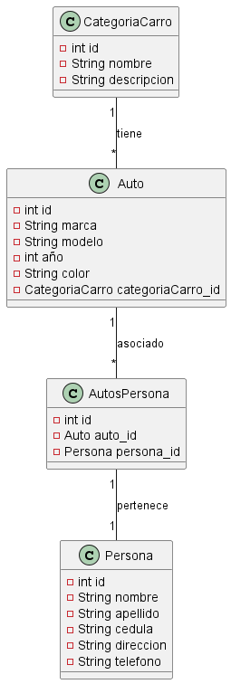

# Corte2_1007531364
Parcial


## Necesidad: Sistema de Gestión de Autos y Personas

### Descripción:
Se requiere desarrollar un sistema de gestión para controlar la información relacionada con autos y personas. El sistema debe permitir registrar, consultar y asociar datos específicos sobre categorías de carros, autos individuales y sus propietarios.


### Requerimientos Funcionales (RF):

1. **Gestión de Categorías de Carro (CategoriaCarro)**:
    - **RF1**: El sistema debe permitir registrar y gestionar las categorías de carros con la siguiente información:
        - **Identificador único (id)**
        - **Nombre**
        - **Descripción**

2. **Registro y Gestión de Autos (Auto)**:
    - **RF2**: El sistema debe permitir registrar y gestionar los autos con la siguiente información:
        - **Identificador único (id)**
        - **Marca**
        - **Modelo**
        - **Año de Fabricación**
        - **Color**
        - **Categoría de Carro (categoriaCarro_id)**

3. **Asociación de Autos con Personas (AutosPersona)**:El sistema debe permitir asociar autos a personas con la siguiente información:
    - **RF3**
        - **Identificador único (id)**
        - **Auto (auto_id)**
        - **Persona (persona_id)**


4. **Registro de Datos de Personas (Persona)**:
    - El sistema debe permitir registrar información sobre las personas con la siguiente información:
    - **RF4**
        - **Identificador único (id)**
        - **Nombre completo de la persona**
        - **Apellido de la persona**
        - **Número de cédula**
        - **Dirección de residencia**
        - **Número de teléfono de contacto**


> Script de la base de datos
```sql

CREATE DATABASE ControlAutosPersonas;


USE ControlAutosPersonas;


CREATE TABLE CategoriaCarro (
    id INT NOT NULL PRIMARY KEY AUTO_INCREMENT,
    nombre VARCHAR(100) NOT NULL,
    descripcion TEXT
);

CREATE TABLE Auto (
    id INT NOT NULL PRIMARY KEY AUTO_INCREMENT,
    marca VARCHAR(100) NOT NULL,
    modelo VARCHAR(100) NOT NULL,
    año INT NOT NULL,
    color VARCHAR(50) NOT NULL,
    categoriaCarro_id INT NOT NULL,
    FOREIGN KEY (categoriaCarro_id) REFERENCES CategoriaCarro(id)
);

CREATE TABLE Persona (
    id INT NOT NULL PRIMARY KEY AUTO_INCREMENT,
    nombre VARCHAR(100) NOT NULL,
    apellido VARCHAR(100) NOT NULL,
    cedula VARCHAR(20) NOT NULL,
    direccion TEXT,
    telefono VARCHAR(20)
);


CREATE TABLE AutosPersona (
    id INT NOT NULL PRIMARY KEY AUTO_INCREMENT,
    auto_id INT NOT NULL,
    persona_id INT NOT NULL,
    FOREIGN KEY (auto_id) REFERENCES Auto(id),
    FOREIGN KEY (persona_id) REFERENCES Persona(id)
);


> Ver



# Ver planificación 
[Ver Aquí](https://trello.com/invite/b/5UKVvSty/ATTI3592e7e0d2b1ef3160e1c435523263335C70E29C/parcial)